# Ecommerce System

## Context
Descriptiondescriptiondescriptiondescriptiondescriptiondescriptiondescriptiondescriptiondescriptiondescriptiondescriptiondescriptiondescriptiondescriptiondescriptiondescription

## Tech Stack
- Backend: Asp.Net Core 8, Entity Framework, Microsoft SQL Server, Redis.

## Architecture
- Clean Architecture
- CQRS Pattern
- Repository Pattern
- Global Transactions
- Minimal API

## Relational Database
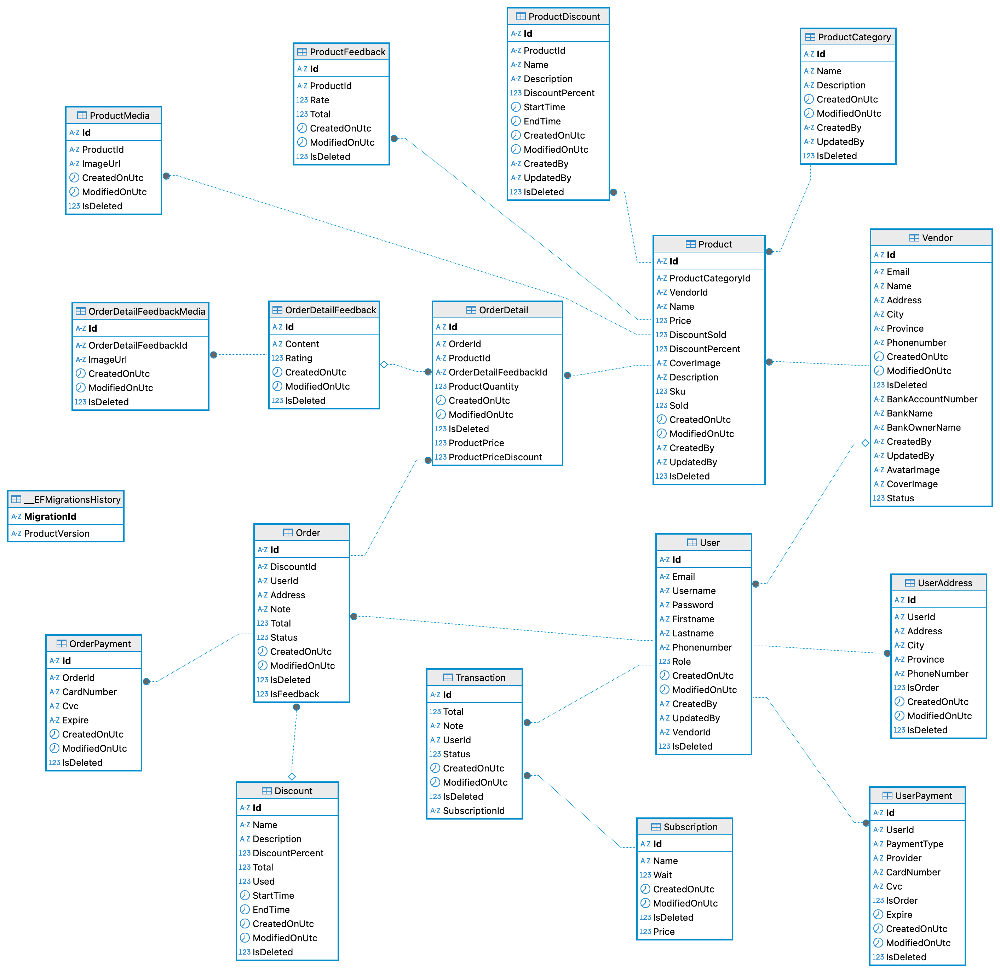

## User Screens
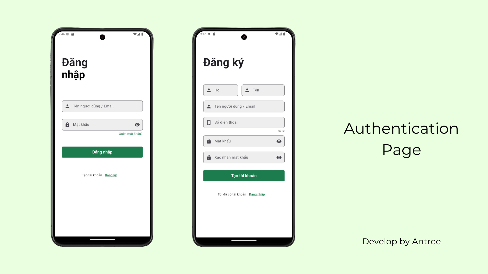
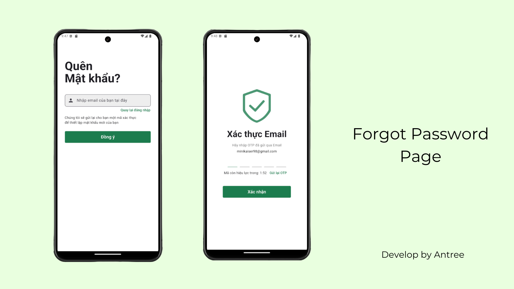
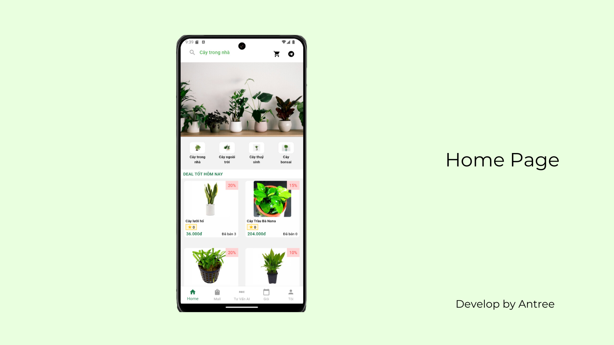
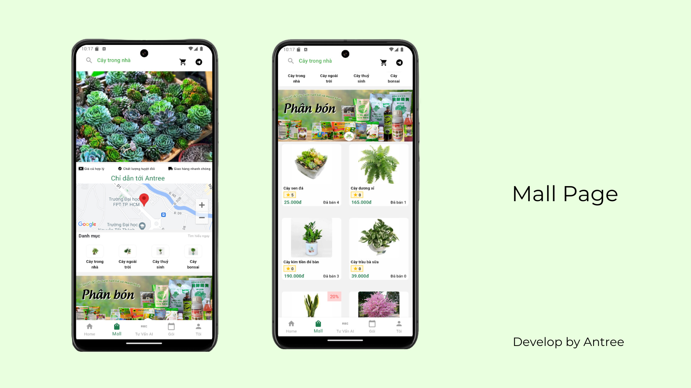
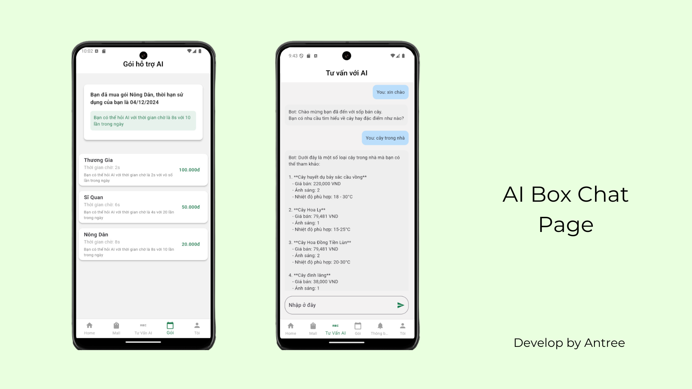

## Vendor Screens
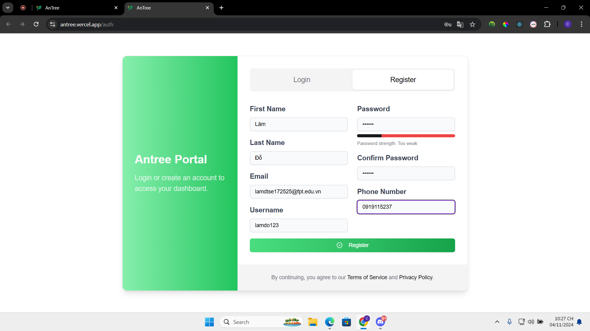
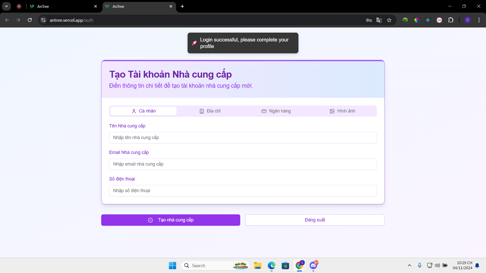
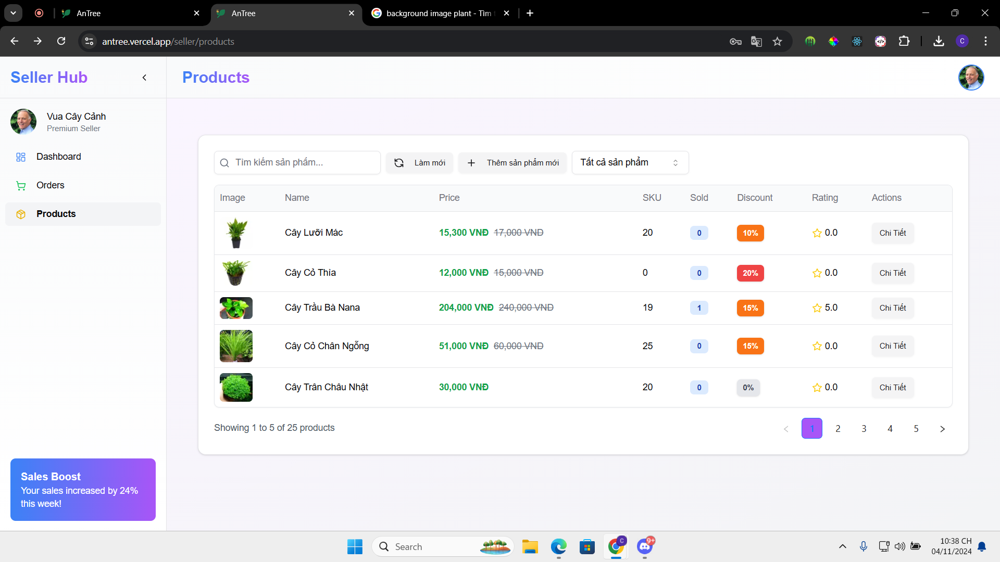
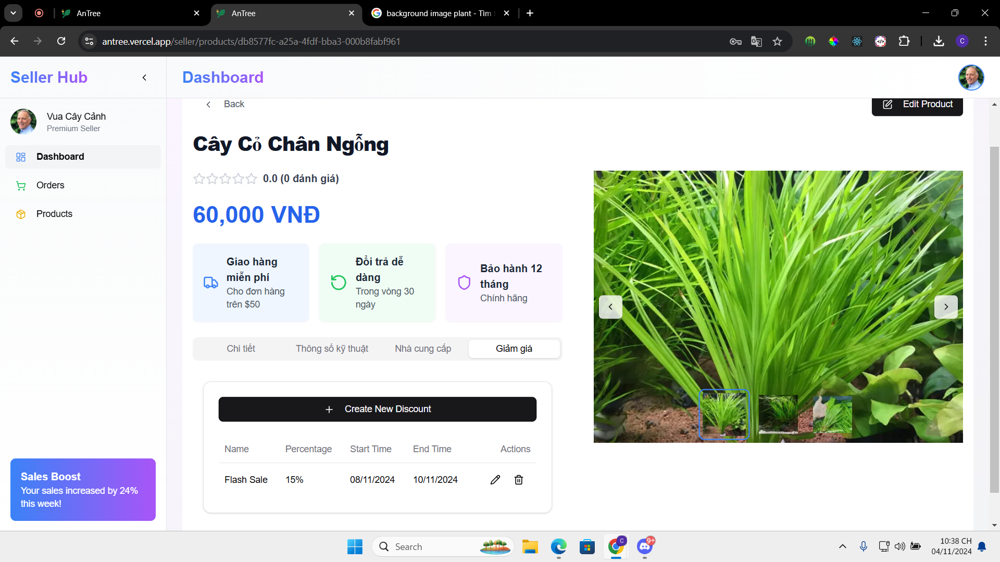

## Admin Screens
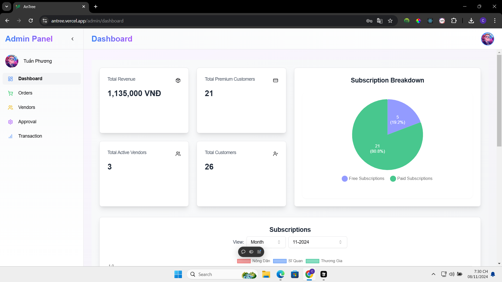
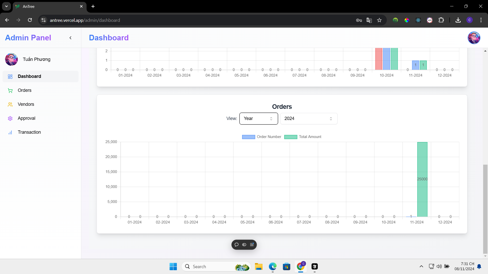

## Demo Video
<iframe width="560" height="315" src="https://www.youtube.com/embed/xojdwtRskxo"
frameborder="0" allow="accelerometer; autoplay; clipboard-write; encrypted-media; gyroscope; picture-in-picture" allowfullscreen></iframe>
