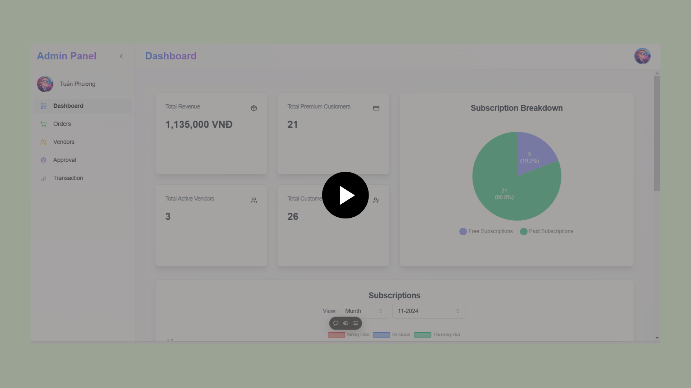

# 🌳 **AnTree - An E-commerce System for Trees!**

---

## 🌟 **Context**
Driven by a passion for trees and the need to challenge a monopoly in tree e-commerce, this platform connects vendors and customers through a transparent and user-friendly system. By combining AI-driven advice, modern e-commerce features, and sustainable practices, it empowers users, promotes accessibility, and fosters a thriving tree-loving community.

---

## 🛠️ **Features**

### 🏢 **Admin**
- Manage revenue by dashboard (from orders and subscriptions).
- Manage Vendors.
- Manage Users.
- Approve new requests to become an Antree partner.
- Manage Orders.
- Manage Transactions.

### 🛍️ **Vendors**
- Manage revenue by dashboard (from orders).
- Manage vendor products.
- Add new discounts for products.
- Manage orders.

### 👤 **Customers**
- Order products.
- Buy subscription services (to increase response speed).
- Communicate with AI for advice.
- Manage orders.

---

## ⚙️ **Tech Stack**
- **Backend**:
    - Main System: Asp.Net Core 8, Entity Framework.
    - AI System: ExpressJS, TypeScript.
- **Database**: Microsoft SQL Server, Redis.
- **Frontend**: NextJS, TypeScript.
- **Mobile**: Flutter, Dart.

---

## 🏛️ **Architecture**
- Clean Architecture
- CQRS Pattern
- Repository Pattern
- Global Transactions
- Minimal API

---

## 📊 **Relational Database**

---

## 📱 **User Screens**
  
  
  
  

---

## 🛒 **Vendor Screens**
  
  
  

---

## 🖥️ **Admin Screens**
  

---

## 🎥 **Demo Videos**
- **Buying Flow**: 
- **Buying Subscription and Chat Box AI Flow**: 
- **Antree Landing Page & Partner Registration Flow**: 
- **Admin and Vendor Management**: 

---

## 📂 **Project Repository**
- **Backend Repository**: [AN-TREE_BACKEND_E-COMMERCE-SYSTEM](https://github.com/bentran1vn/AN-TREE_BACKEND_E-COMMERCE-SYSTEM)
- **AI Bot Chat Repository**: [AN-TREE_BOTCHAT-SERVER_E-COMMERCE-SYSTEM](https://github.com/bentran1vn/AN-TREE_BOTCHAT-SERVER_E-COMMERCE-SYSTEM)
- **Admin Web Repository**: [AN-TREE_FRONTEND-WEB_E-COMMERCE-SYSTEM](https://github.com/nguyenpro22/AN-TREE_FRONT-END-WEB_E-COMMERCE-SYSTEM)
- **Mobile Repository**: [AN-TREE_FRONTEND-MOBILE_E-COMMERCE-SYSTEM](https://github.com/lama-try-code/AN-TREE_FRONT-END-MOBILE_E-COMMERCE-SYSTEM)

---

## 🤝 **Contributors**
We would like to extend our heartfelt thanks to all the members who contributed to the **AnTree E-commerce System** project. Your hard work and dedication have been invaluable!

| **Name**            | **GitHub Username**                     | **Role**                          |  
|---------------------|-----------------------------------------|-----------------------------------|  
| Tran Dinh Thien Tan | [bentran1vn](https://github.com/bentran1vn) | Project Lead, Backend Developer  |  
| Cao Van Dung        | [nguyenpro22](https://github.com/nguyenpro22) | Web Frontend Developer           |  
| Do Tran Lam         | [lama-try-code](https://github.com/lama-try-code) | Mobile Frontend Developer        |  
